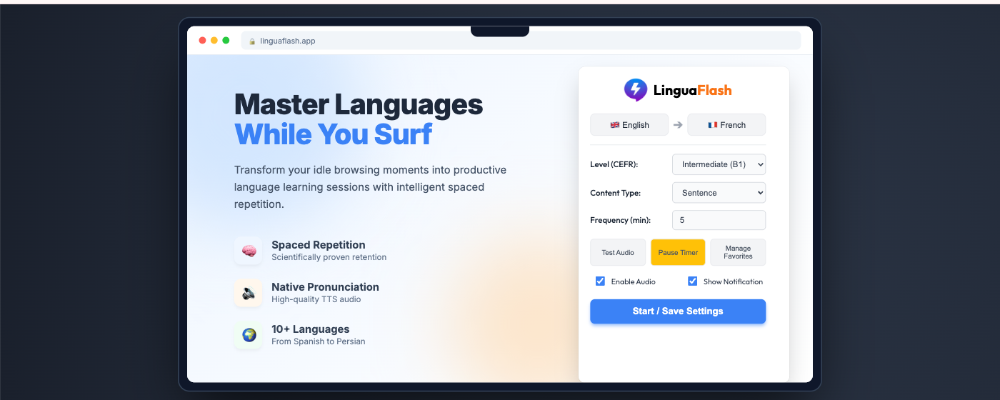
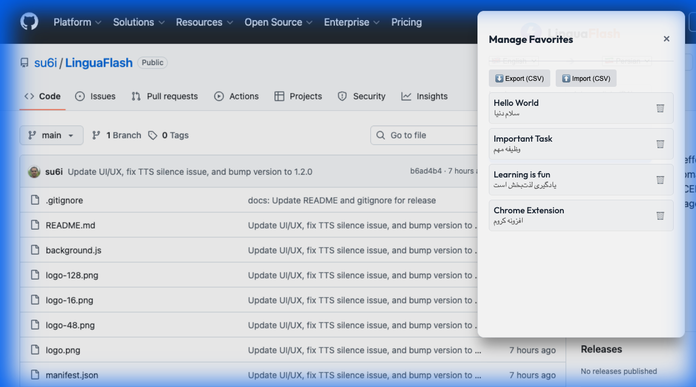
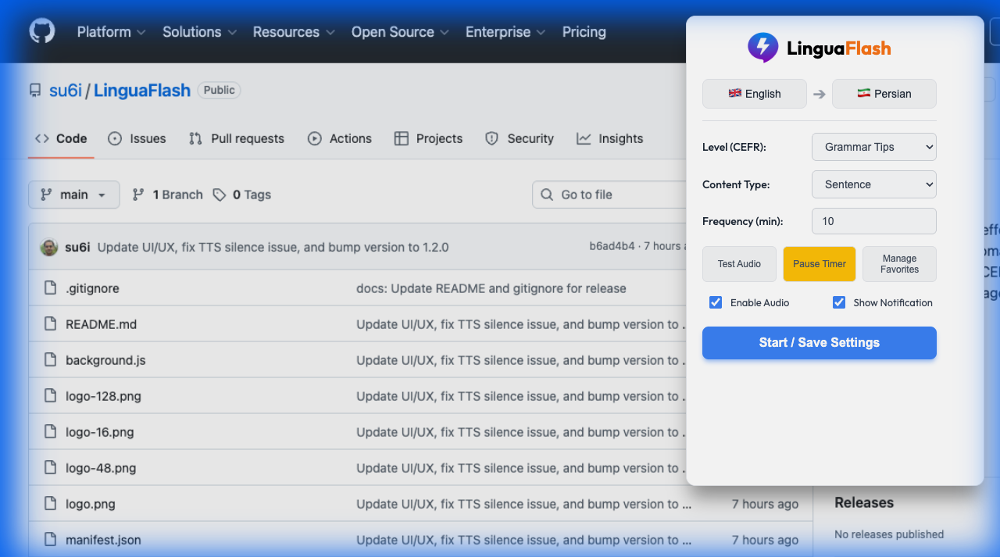
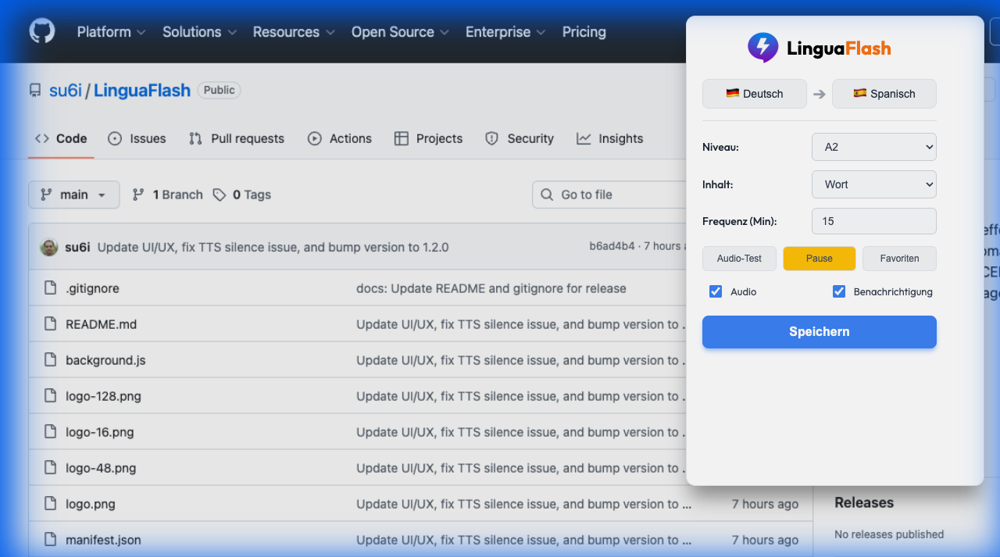
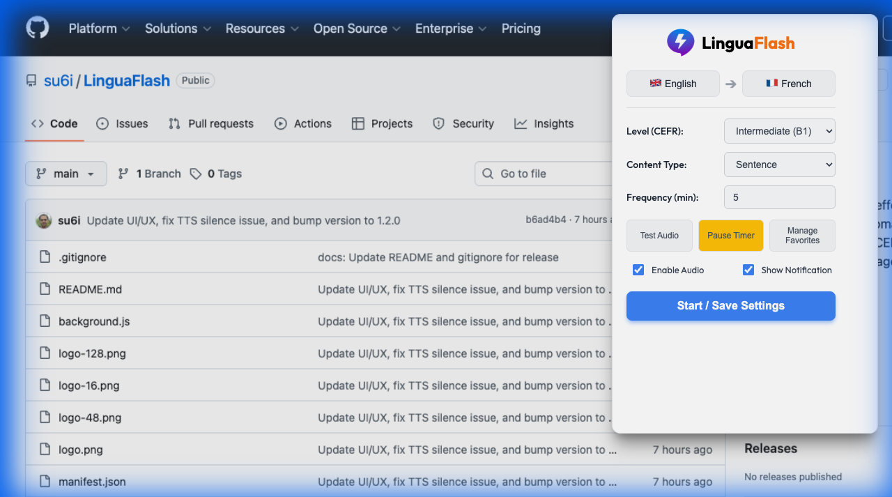
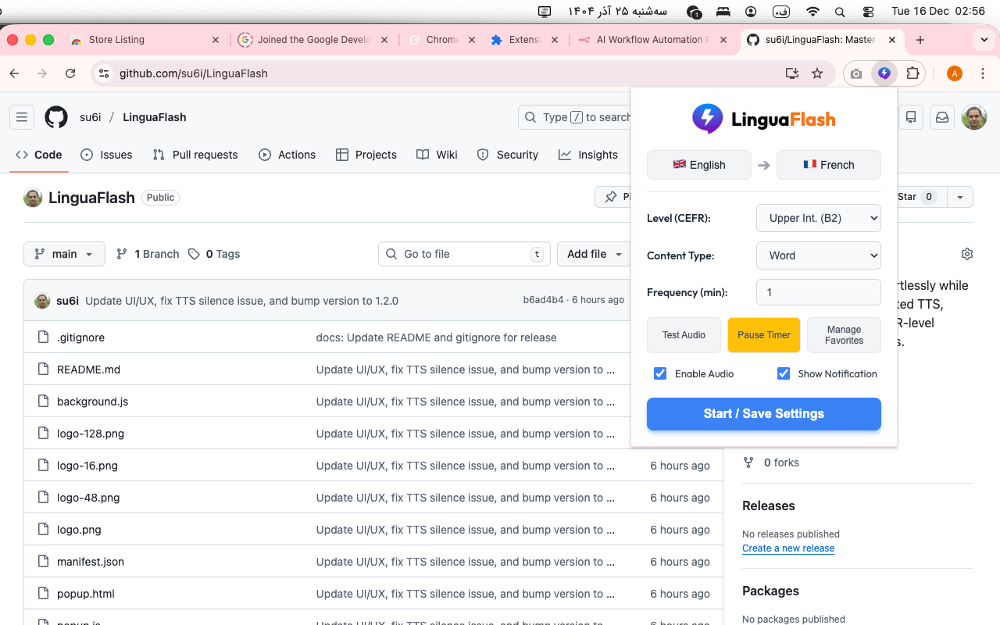
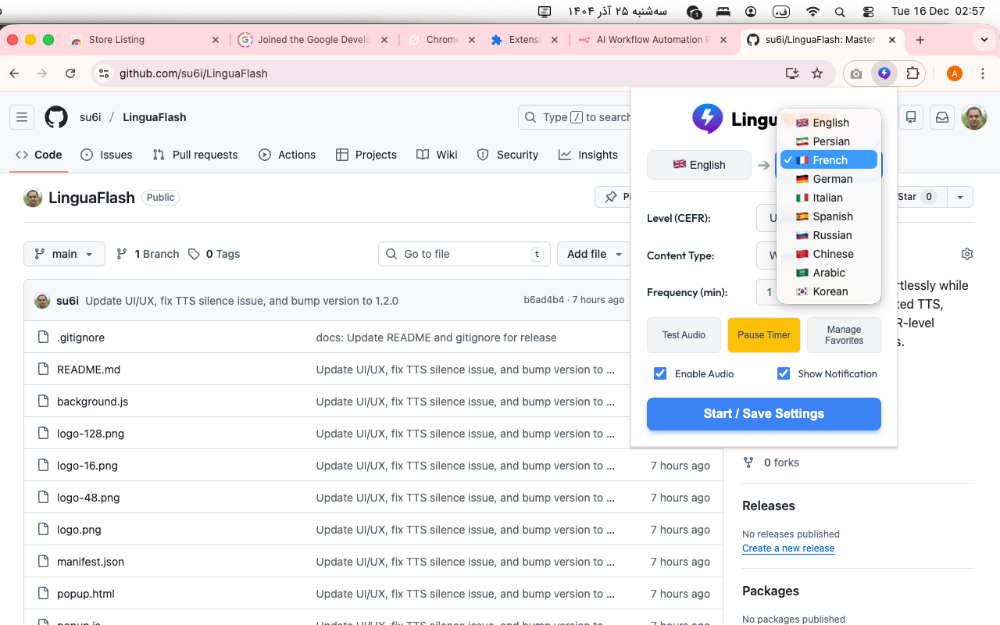
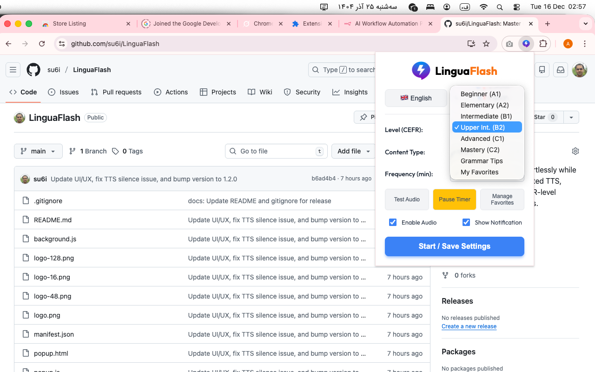
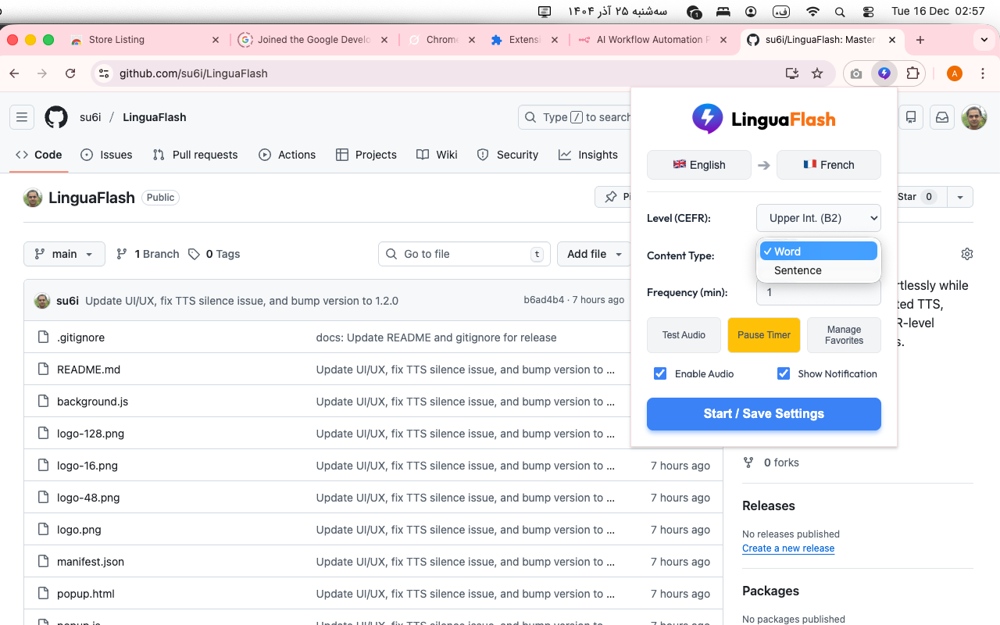

  
  <h1>LinguaFlash ⚡</h1>
  
  
  
  
  
  

**LinguaFlash** is a smart Chrome extension designed to help you learn new languages seamlessly while browsing the web. By utilizing **Spaced Repetition** and interval-based notifications, it introduces new vocabulary and sentences with automated pronunciation, ensuring consistent learning without disrupting your workflow.

## 🚀 Features

- **Refined User Interface**: A modern, clean card-based design with an intuitive layout for easier settings management.
- **Robust Audio Engine**: Improved TTS reliability with smart queueing to prevent silence/crashes, plus a natural pause between sentences.
- **Multi-Language Support**: Learn **English, French, German, Italian, Spanish, Russian, Chinese, Arabic, Korean, and Persian (Native)**.
- **Massive Vocabulary Database (1,600+ Items)**:
    - **A1 (Beginner):** 201 items (Basic words, Family, Colors).
    - **A2 (Elementary):** 243 items (Simple sentences, Daily routine).
    - **B1 (Intermediate):** 200 items (Work, Travel, Health).
    - **B2 (Upper Intermediate):** 203 items (Complex topics, Abstract concepts).
    - **C1/C2 (Advanced/Mastery):** 550 items (Professional & Literary).
    - **Grammar Tips:** 200 items with **Native-Logic Explanation** (e.g., teaching "Ezafe" for Persian instead of English 's).
- **Interval Notifications**: Set a timer (e.g., every 5 minutes) to receive a flashcard with audio.
- **Auto-Pronunciation (TTS)**: Listens to the target language followed by your native language for reinforcement.
- **Smart Pause**: Quickly pause sessions during meetings or focus time without disabling the extension.
- **Favorites Manager**:
    - Right-click any text on the web to "Add to LinguaFlash".
    - **Edit, Translate, Import, and Export (CSV)** your collection.
- **Customizable Settings**: Independent toggles for **Enable Audio** and **Show Notification**, plus adjustable frequency.
- **Fully Localized UI**: Interface adapts completely to your preferred language (supporting all 10 languages including Persian, Arabic, & Chinese).

## 📸 Visual Tour

  <table>
    <tr>
      <td align="center" width="50%">
        
         <b>📁 Favorites Manager</b> Import, Export, and Edit your items.
      </td>
      <td align="center" width="50%">
        
         <b>💡 Grammar Tips</b> Native-logic explanations for hard concepts.
      </td>
    </tr>
    <tr>
      <td align="center" width="50%">
        
         <b>🌍 Multi-Language Support</b> Learn 10+ languages with localized UI.
      </td>
      <td align="center" width="50%">
        
         <b>✨ Seamless Integration</b> Unobtrusive design that fits your browser.
      </td>
    </tr>
     <tr>
      <td align="center" width="50%">
        
         <b>🎯 Interactive Learning</b> Engage with content in real-time.
      </td>
      <td align="center" width="50%">
        
         <b>🌐 10+ Languages</b> A wide range of supported languages.
      </td>
    </tr>
    <tr>
      <td align="center" width="50%">
        
         <b>📊 CEFR Levels</b> From Beginner (A1) to Advanced (C1).
      </td>
      <td align="center" width="50%">
        
         <b>📚 Rich Content</b> Thousands of words and sentences.
      </td>
    </tr>
  </table>

## 📦 Installation
 
### 🌟 Recommended: Chrome Web Store
**[Download LinguaFlash from the Chrome Web Store](https://chromewebstore.google.com/detail/kbnggdhjaflioffhgjngoopojcmoaano)** for the best experience and automatic updates.

### 🛠 Manual Installation (Developer Mode)
1. Clone or download this repository.
2. Open Google Chrome and navigate to `chrome://extensions`.
3. Enable **"Developer mode"** (top right toggle).
4. Click **"Load unpacked"**.
5. Select the **LinguaFlash** directory.

> **Note on Timing**: Chrome enforces a minimum alarm interval of **1 minute**. To save battery, the browser may occasionally delay notifications if your computer is idle or under heavy load. This is standard browser behavior.

## 🛠 Usage

1.  **Setup**: Click the extension icon. Choose your **Source Language** (Native) and **Target Language** (Learning).
2.  **Select Material**: Pick a CEFR level (e.g., B1 Sentences) or "My Favorites".
3.  **Set Timer**: Choose how often you want to see a card.
4.  **Manage Favorites**: Use the 📂 button to view, edit, import, or export your custom list.

## 🔮 Roadmap

-   [x] **Standardized Database**: Merged vocabulary and sentences into a unified structure.
-   [x] **Native Grammar Logic**: Replaced English-centric grammar rules with native explanations for all 8 target languages.
-   [x] **Data Quality Audit**: 
    -   100% Native Example Coverage.
    -   Zero Duplicate Items.
    -   Zero "English Leakage" in translations.
-   [x] **Chrome Web Store Publishing**:
    -   [x] Prepare promotional images (1280x800, 440x280).
    -   [x] Prepare privacy policy URL.
    -   [x] Verify production build settings (optimize code, remove logs).
-   [ ] **Leitner System Implementation**: Advanced spaced repetition logic to track learning progress for each word.
    -   [ ] Automated progression through "boxes" based on correct/incorrect recall.
    -   [ ] Optimized review intervals for long-term retention.
-   [ ] **Cloud Sync**: Optional Google Drive sync for progress across devices.

## 👨‍💻 Author

**Developed by [Su6i](https://www.linkedin.com/in/su6i/)**

Designed for language enthusiasts who want to turn every browsing session into a learning opportunity.
